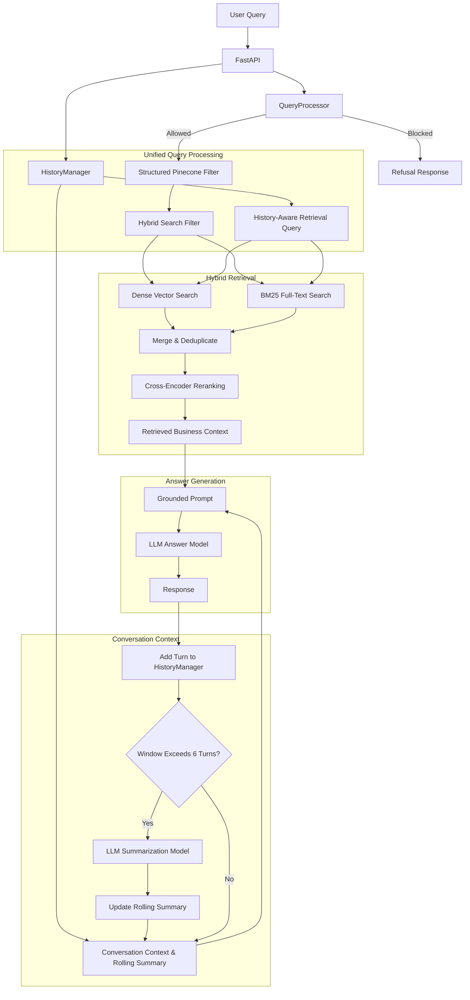
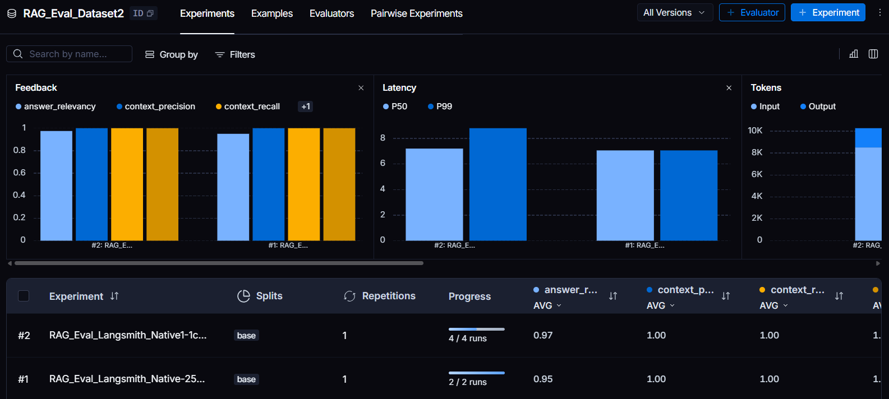

# RAG Local Business Assistant

A Retrieval-Augmented Generation API that lets hotel staff answer guest questions about nearby restaurants, spas, and bars in natural language, grounded in real business data.

> **Why this exists:** A similar system was built for a client, a hotel chain that wanted front-desk and concierge staff to instantly answer questions like *"where's the nearest restaurant that serves burgers?"* instead of manually searching places and reading reviews, and comparing places for guests to recommend. This project reimplements that concierge-assistant pattern on a public dataset (hotels, spas, and restaurants in Finland) as a portfolio build.


## What it does

A guest asks the front desk: *"Is there a burger place nearby?"* Staff type the question into the assistant and get back a grounded, natural-language answer: which restaurant, how far it is, its rating, and its services. Pulled from real business records instead of a generic LLM guess.

Example questions:

- `Find a hotel in Helsinki with a swimming pool`
- `Which spa in Espoo offers sports massage?`
- `Find a restaurant in Vantaa serving biryani and seekh kebab`

## Features

### Retrieval-Augmented Generation

- Loads hotel, massage, and restaurant records from the `data/` directory.
- Converts records into Pinecone-compatible records with searchable text and metadata (including distance and rating).
- Creates or connects to a Pinecone index named `rag-hotel`.
- Uses Pinecone-hosted `llama-text-embed-v2` embeddings through the integrated model index API.
- Retrieves the five most relevant records from the `services-providers` namespace with hybrid search.
- Builds a grounded answer prompt from retrieved business context.

### BM25 and hybrid search

- Maintains a dense vector index (`rag-hotel`) for semantic similarity search.
- Maintains a separate Pinecone full-text index (`rag-hotel-fts`) for BM25 keyword search over `chunk_text`.
- Upserts every prepared record into both indexes in the `services-providers` namespace.
- Applies the same LLM-generated metadata filter to both dense and BM25 searches.
- Merges and deduplicates candidates by record ID, then reranks the combined set with Pinecone's `bge-reranker-v2-m3` model.
- Returns up to five reranked records to the answer-generation prompt, combining semantic matches with exact terms such as city names, services, and dishes.

### Unified query processing

- Uses a single Groq call via `QueryProcessor` to combine guardrails, category detection, and filter extraction.
- Recognizes the categories `hotel`, `spa`, and `restaurant`.
- Extracts category, name, city, region, rating, distance, and requested services in one structured JSON response.
- Maps user terms to known services such as `Swimming Pool`, `Hot Stone Massage`, `Biryani`, and `Chocolate Cake`.
- Applies the generated filters to Pinecone metadata search.
- Reduces the old two-call pattern to one LLM invocation — a single call for guardrails and parsing instead of two separate calls.

### Query guardrails

- Clear policy violations are refused immediately, before retrieval runs.
- The refusal decision is made inside the same model call that produces the structured filter, rather than a separate guardrail pass.
- *(A previous standalone guardrail module and query builder have been superseded by this unified `QueryProcessor` and are kept in the codebase only for reference.)*

### Conversation awareness

- Stores recent query/response pairs in a `HistoryManager`.
- Keeps a sliding window of recent conversation turns.
- Uses recent conversation when building retrieval queries and answer prompts — so a follow-up like *"what about one with outdoor seating?"* still resolves correctly.
- Folds turns that leave the window into an LLM-generated rolling summary.
- Preserves user preferences, locations, requested services, selected places, and unresolved questions in the summary.

## API endpoints

| Method | Path | Description |
| --- | --- | --- |
| `POST` | `/` | Search the local business data and generate an answer. |
| `GET` | `/health` | Return the service health status. |
| `GET` | `/eval` | Run the LangSmith RAG evaluation. |

## Request and response

Send a natural-language query to `POST /`:

```json
{
  "query": "Find a hotel in Helsinki with a pool"
}
```

Response:

```json
{
  "response": "..."
}
```

Conversation turns are currently maintained by the server-side `HistoryManager`. The client does not send a history field in the current request model.

## Request flow



## Technology stack

- Python
- FastAPI
- Pinecone (dense vector search, BM25 full-text search, and reranking)
- LangChain
- Groq (LLM)
- LangSmith
- Pydantic
- Uvicorn
- Pytest

## Project structure

```text
app/
	appInitlize.py       Configuration, Pydantic models, and service initialization
	dataBase.py          Pinecone connection, index setup, upsert, and search
	eval.py              LangSmith evaluation metrics and runner
	evalData.py          Evaluation query and reference data
	guardrails.py        Legacy guardrail implementation (obsolete)
	history_manager.py   Recent conversation window and rolling summary
	logger.py            Application logging
	main.py              FastAPI application and request orchestration
	models.py            Groq model wrapper
	prepareData.py       Source-record transformation for Pinecone
	prompt.py            Context and answer prompt construction
	query_creator.py     Legacy query parser (obsolete)
	queryProcessor.py    Unified guardrail + query parsing LLM processor
	readData.py          Local data loading

frontend/
	frontend.py

data/
	hotels.txt
	massage.txt
	restaurants.txt

test/
	database_test.py
	liberies_test.py
	main_test.py
	model_test.py
```

## Configuration

Create a local `config.ini` file with the API keys expected by the application:

```ini
[KEYS]
groq_api_key = your-groq-api-key
pinecone_api_key = your-pinecone-api-key
langsmith_api_key = your-langsmith-api-key
```

Do not commit credentials. Rotate any key that has been exposed in source control or logs.

### LangSmith monitoring

LangSmith is used to monitor the RAG evaluation runs. The application uses the
`langsmith_api_key` from `config.ini` when the `/eval` endpoint starts an
evaluation. The intended LangSmith project is `hotel_RAG`, where you can
inspect experiment results and per-example evaluator scores.

The configured monitoring values are:

```text
LANGSMITH_TRACING = True
LANGSMITH_PROJECT = hotel_RAG
```

The current evaluation client uses the API key directly; configure the
LangSmith project in the runtime environment if your LangSmith account does
not use `hotel_RAG` as the default project.

Start the API and call `GET /eval` to create or reuse the evaluation dataset
and send the latest evaluation run to LangSmith. See [Run the evaluation](#run-the-evaluation)
for the command and the metrics that are reported.

## Installation

From the repository root:

```powershell
python -m venv RAGENV
.\RAGENV\Scripts\Activate.ps1
python -m pip install --upgrade pip
pip install -r requirements.txt
```

## Run the API

```powershell
.\RAGENV\Scripts\python.exe -m uvicorn app.main:app --reload
```

## Run the evaluation

The evaluation uses LangSmith to run the RAG pipeline against the examples in
`app/evalData.py`. Each example contains a user query and a reference answer.
The evaluator creates or reuses the `RAG_Eval_Dataset2` dataset and records an
experiment in LangSmith.

It reports four LLM-judged metrics, each scored from `0.0` to `1.0`:

- **Context precision**: whether relevant retrieved records are ranked near the top.
- **Context recall**: whether the retrieved records contain the information needed for the reference answer.
- **Faithfulness**: whether the generated answer is supported by the retrieved records.
- **Answer relevancy**: whether the answer directly addresses the user’s question.

Start the API, then call the evaluation endpoint from a second PowerShell terminal:

```powershell
Invoke-RestMethod -Uri http://127.0.0.1:8000/eval -Method Get
```

The endpoint returns `{ "data": "ok" }` after the run completes. Open the
corresponding project in LangSmith to inspect per-example scores and evaluator
reasoning. Evaluation requires a valid `langsmith_api_key` in `config.ini` and
uses the configured Groq and Pinecone credentials as well.



## Run with Docker

Build the image from the repository root:

```powershell
docker build -t rag-pinecone .
```

Run the API with the local configuration mounted read-only:

```powershell
docker run --rm -p 8000:8000 -v "${PWD}\config.ini:/app/config.ini:ro" rag-pinecone
```

Open the interactive API documentation at:

http://127.0.0.1:8000/docs

Example PowerShell request:

```powershell
Invoke-RestMethod `
	-Uri http://127.0.0.1:8000/ `
	-Method Post `
	-ContentType "application/json" `
	-Body '{"query":"Find a hotel in Helsinki with a pool"}'
```

## Run the Streamlit frontend

Start the API first, then run the frontend from the repository root in a second terminal:

```powershell
streamlit run frontend/frontend.py
```

The frontend connects to `http://127.0.0.1:8000/` by default. It provides a chat interface and an optional city filter for hotels, spas, and restaurants in Finland.


## Tests

Run the test suite with:

```powershell
.\RAGENV\Scripts\python.exe -m pytest
```

The tests cover the database, model wrapper, and API behavior. Conversation-specific tests should be expanded as session isolation and persistence are added.

## Project status

This is a learning and portfolio project focused on RAG pipeline design, vector search, prompt engineering, LLM integration, and evaluation experiments. It is not currently intended as a production multi-user service.
