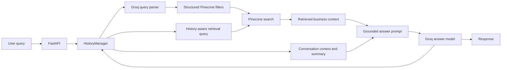

# RAG Local Business Assistant

A Retrieval-Augmented Generation API for discovering hotels, spas, and restaurants in Finland. The service combines structured local data, Pinecone search, LLM-generated metadata filters, and Groq response generation to answer natural-language questions with grounded business information.

Example questions:

- `Find a hotel in Helsinki with a swimming pool`
- `Which spa in Espoo offers sports massage?`
- `Find a restaurant in Vantaa serving biryani and seekh kebab`

## Features

### Retrieval-Augmented Generation

- Loads hotel, massage, and restaurant records from the `data/` directory.
- Converts records into Pinecone-compatible records with searchable text and metadata.
- Creates or connects to a Pinecone index named `rag-hotel`.
- Uses Pinecone hosted `llama-text-embed-v2` embeddings through the integrated model index API.
- Retrieves the five most relevant records from the `services-providers` namespace.
- Builds a grounded answer prompt from retrieved business context.

### Natural-language query understanding

- Uses Groq to convert a natural-language request into a structured JSON filter.
- Recognizes the categories `hotel`, `spa`, and `restaurant`.
- Extracts category, name, city, region, rating, distance, and requested services.
- Maps user terms to known services such as `Swimming Pool`, `Hot Stone Massage`, `Biryani`, and `Chocolate Cake`.
- Applies the generated filters to Pinecone metadata search.

### Conversation awareness

- Stores recent query and response pairs in a `HistoryManager`.
- Keeps a sliding window of recent conversation turns.
- Uses recent conversation when building retrieval queries and answer prompts.
- Folds turns that leave the window into an LLM-generated rolling summary.
- Preserves user preferences, locations, requested services, selected places, and unresolved questions in the summary.


### API endpoints

| Method | Path | Description |
| --- | --- | --- |
| `POST` | `/` | Search the local business data and generate an answer. |
| `GET` | `/health` | Return the service health status. |
| `GET` | `/eval` | Evaluation endpoint placeholder. |

## Request and response

Send a natural-language query to `POST /`:

```json
{
	"query": "Find a hotel in Helsinki with a pool"
}
```

Response:

```json
{
	"response": "..."
}
```

Conversation turns are currently maintained by the server-side `HistoryManager`. The client does not send a history field in the current request model.

## Request flow



## Technology stack

- Python
- FastAPI
- Pydantic
- Uvicorn
- Pinecone
- Groq
- LangChain Groq integration
- Pytest
- PowerShell for local development on Windows

## Project structure

```text
app/
	appInitlize.py       Configuration, Pydantic models, and service initialization
	dataBase.py          Pinecone connection, index setup, upsert, and search
	eval.py              Evaluation module placeholder
	evalData.py          Evaluation query and reference data
	history_manager.py   Recent conversation window and rolling summary
	logger.py            Application logging
	main.py              FastAPI application and request orchestration
	models.py            Groq model wrapper
	prepareData.py       Source-record transformation for Pinecone
	prompt.py            Context and answer prompt construction
	query_creator.py     LLM query parsing and metadata filter creation
	readData.py          Local data loading

data/
	hotels.txt
	massage.txt
	restaurants.txt

test/
	database_test.py
	liberies_test.py
	main_test.py
	model_test.py
```

## Configuration

Create a local `config.ini` file with the API keys expected by the application:

```ini
[KEYS]
groq_api_key = your-groq-api-key
pinecone_api_key = your-pinecone-api-key
```

Do not commit credentials. Rotate any key that has been exposed in source control or logs.

## Installation

From the repository root:

```powershell
python -m venv RAGENV
.\RAGENV\Scripts\Activate.ps1
python -m pip install --upgrade pip
pip install -r requirements.txt
```

## Run the API

```powershell
.\RAGENV\Scripts\python.exe -m uvicorn app.main:app --reload
```

Open the interactive API documentation at:

http://127.0.0.1:8000/docs

Example PowerShell request:

```powershell
Invoke-RestMethod `
	-Uri http://127.0.0.1:8000/ `
	-Method Post `
	-ContentType "application/json" `
	-Body '{"query":"Find a hotel in Helsinki with a pool"}'
```

## Tests

Run the test suite with:

```powershell
.\RAGENV\Scripts\python.exe -m pytest
```

The tests cover the database, model wrapper, and API behavior. Conversation-specific tests should be expanded as session isolation and persistence are added.

## Project status

This is a learning and portfolio project focused on RAG pipeline design, vector search, prompt engineering, LLM integration, and evaluation experiments. It is not currently intended as a production multi-user service.

